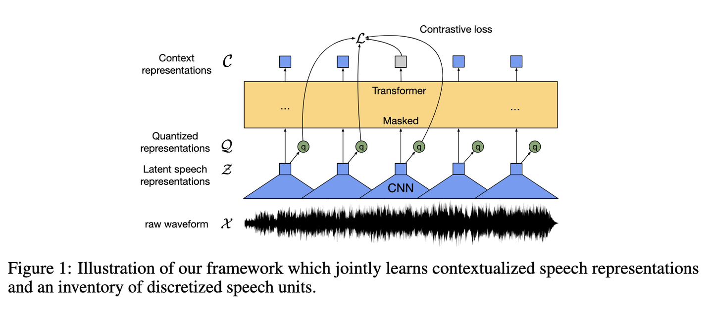
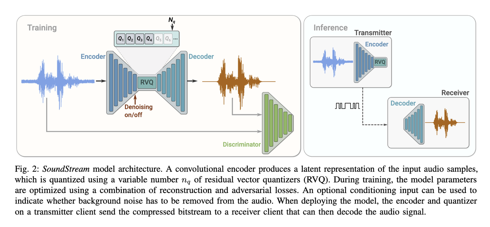
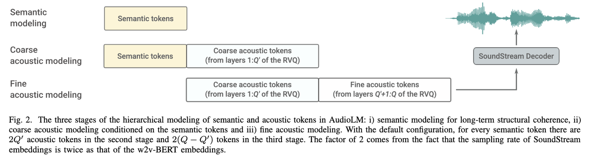
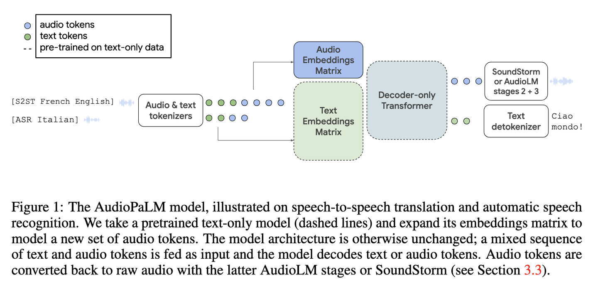
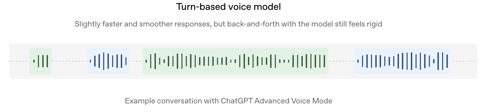
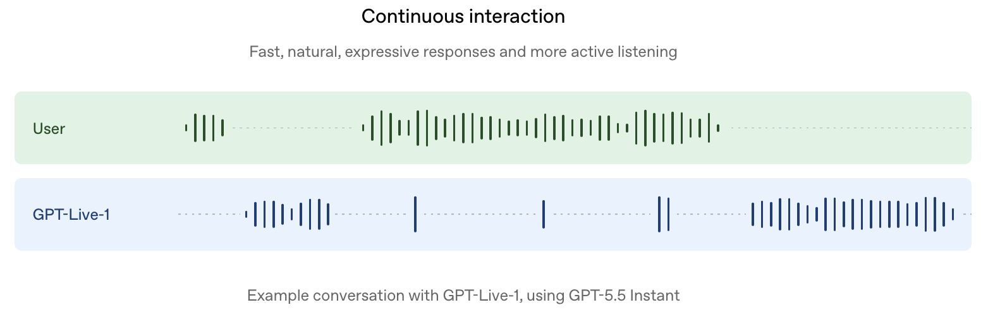
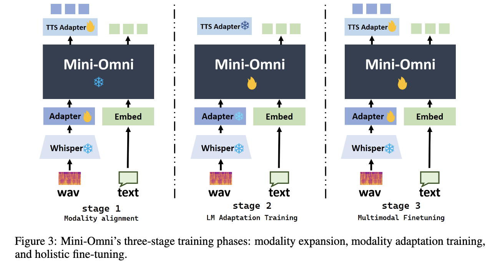
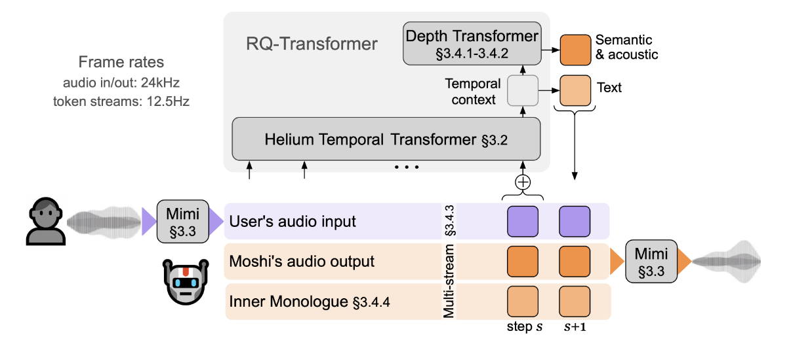

I came from a background in speech signal processing.
Long before large language models became as red-hot as they are today, speech-related technology had already traveled a long journey from academic research to engineering deployment.
It was only after OpenAI released ChatGPT in late 2022 that the AI spotlight seemed to be completely stolen by current Large Language Models.
However, looking back at the history of AI research, deep learning actually achieved its very first large-scale engineering deployment in speech-based human-computer interaction.
Before 2020, applications of vision and text processing technologies in human-computer interaction often felt like "artificial stupidity".
Due to accumulating more and more data, making models larger, and model capabilities stronger, we have arrived at today's application.

If you have previously used voice assistant features in ChatGPT or similar applications, you will notice that these applications have a button to start a voice-recorded conversation.
The first-generation products worked much like sending WeChat voice messages: you had to tap a recording button, have your voice recognized into text, and then send it out.
At its core, this was still speech recognition technology followed by text-mode ChatGPT technology.
Later, it gradually evolved into today's phone-call-like experience.
This is due to the exploration and development of Speech Multimodal Large Language Models (Speech MLLMs).
This article attempts to give readers a glimpse into the technical evolution background, system architectures, and engineering deployment methods of Speech MLLMs, hoping that different readers can gain valuable insights from it.

Let's first turn back to the first-generation ChatGPT.
Our voice interaction experience with it always carried an unerasable sense of "mechanicalness" and "sluggishness".
Even if the backend language model had evolved to be extremely intelligent, whenever you initiated a voice call, the system still felt like it was half a beat slow to respond.
Think of the telemarketing robocalls you often receive, that is exactly how it felt.
The reason cause of this situation lies in the inherent architectural flaws of traditional voice interaction systems.
To break through this bottleneck, academia and industry over the past few years have launched an architectural revolution to directly integrate the speech modality into Large Language Models.

## Problem Definition: What Problem Needs to be Solved?

To understand the evolutionary roadmap of integrating the speech modality into Large Language Models, one must first clearly grasp the fundamental scientific problem of this domain.
Integrating the speech modality into Large Language Models is mapping and unifying continuous, high-dimensional, non-stationary speech signals rich in spatiotemporal information (the inherent characteristics of speech) into the symbolic representation and autoregressive generation space of LLMs, achieving unified, native multimodal modeling of "Perception-Reasoning-Expression".

In traditional technical implementations, the industry commonly adopted the Cascaded Pipeline approach.
It is split into three independent modules:
the first leg consists of an Automatic Speech Recognition (ASR) model converting user input speech into text;
the second leg consists of a text-only Large Language Model (LLM) reading the text and generating response text;
and the third leg consists of a Text-to-Speech (TTS) model converting the response text into audible voice playback.

Although this "three-leg relay" cascaded scheme is very simple to chain together in engineering implementation, it suffers from three insurmountable fatal flaws in information theory and interaction experience:

- **Paralinguistic Information Loss**: Sound is far more than just a carrier of text content. When humans speak, intonation fluctuations, speech rate, stress placement, emotional fluctuations (such as anger, joy, or hesitation), as well as paralinguistic cues like sighs, coughs, and laughter, constitute the vast majority of communication information. When ASR forcibly converts voice into a plain text word sequence, these high-dimensional emotional and acoustic features are completely filtered out. What the large model receives is merely a "text meeting summary" that has lost all sense of presence and emotional tone, naturally making it impossible to produce empathetic responses.

- **Error Cascading and Irreversible Propagation**: Cascaded systems lack a global contextual error-correction mechanism. If the first leg, ASR, misrecognizes a key word due to environmental noise or accents (for instance, making a homophone misrecognition), this error is passed to the LLM as a definitive fact. The LLM then performs logical reasoning based on this false premise, and ultimately the TTS outputs a completely wrong answer. Not a single module in the entire system can trace back or correct errors from previous stages; errors simply compound and get worse.

- **System Latency and Physical Half-Duplex Isolation**: The cascaded approach is strictly serial in time. The system must wait until the ASR explicitly detects silence, segments the sentence, and completes the full decoding output before sending text to the LLM to start inference; after the LLM generates text, it must again wait for the TTS to accumulate sufficient text chunks to synthesize audio. This multi-stage buffering delay, compounded by network transmission overhead, makes it very difficult for end-to-end Round-Trip Time (RTT) to drop to a level imperceptible in natural interaction. Even more seriously, this architecture is physically half-duplex: while the system is playing audio, the input channel is usually closed or ignored, making it impossible to achieve the millisecond-level responses and real-time interruptions that occur so naturally in human communication.

Therefore, natively integrating the speech modality into LLMs is not about making minor tweaks to existing pipeline systems, but about completely abandoning the cascaded architecture to reconstruct a native neural network that can directly understand sound, think in sound, and express in sound.

---

To make it easy to understand, we attempt to establish a clear deconstruction framework:
first, how to turn speech into something that large language models can read and process, this is the speech representation problem;
second, how to fuse this speech representation with large language models to grant them intelligence;
and finally, how to make them converse more like humans, the ultimate problem in human-computer interaction.

## Part 1: How to Represent Speech

The biggest difference between speech and text is that text is inherently discrete, composed of characters and words connected together, and the collection of words can form a closed vocabulary dictionary. Speech, on the other hand, is a continuous, high-sampling-rate sampled waveform signal. For example, 16kHz speech, which we commonly hear, means there are 16,000 sampling values per second. The most primitive speech feature is precisely these 16,000 points stored and recorded per second.

The LLM technological framework is inherently designed for "discrete sequences." You may often hear a term called "token," and we are frequently billed by tokens when calling large model compute power; this token originally represents these discrete units of words or subwords. The entire operational mechanism of large language models—Self-Attention mechanisms, embedding table lookups, Softmax classification, and so on—assumes that inputs are discrete symbols from a finite vocabulary. Therefore, the first problem that must be solved is: how do we convert continuous speech signals into an "LLM-friendly" representation form?

### Directly Using the Output of Encoders from Existing Speech Recognition Models for Speech Representation

As mentioned earlier, using deep neural networks for speech recognition matured into a practical technology at an early stage. In the Transformer era, many Transformer-based techniques were applied to speech recognition technology. A representative work among them is OpenAI's Whisper. Fitting OpenAI's engineering mindset, Whisper was trained using massive multilingual data combined with a Transformer model architecture, with the task of performing speech recognition.

Since the capability of speech recognition models like Whisper has been validated, it naturally possesses the ability to extract speech representations. Thus, researchers thought that the simplest approach is to take a trained Transformer-based speech recognition model and detach its encoder portion for use. Given an audio clip, the encoder outputs a sequence of continuous, hidden-layer feature vectors. Although these vectors were not specifically designed for "representation learning" per se, but were rather intermediate byproducts naturally generated during the ASR model's process of "listening to recognize characters," its encoder output naturally carries strong speech content discrimination ability (otherwise it could not correctly convert speech into text). If the downstream task itself is related to "understanding what is being said" (such as speech understanding or speech Q&A), directly reusing this off-the-shelf, mature encoder is far more economical than designing a representation learning method from scratch.

### Drawing Inspiration from Self-Supervised Pre-Training in the NLP Domain

Recalling the years 2019–2020, technical terms like pre-training and self-supervision were extremely prominent, thanks to the popularization of the BERT paradigm using Transformer architectures for pre-training. At that time, both the speech and image processing communities were contemplating how to introduce the BERT paradigm from NLP into their respective fields to perform representation learning via large-scale self-supervision and pre-training.

This line of research was not satisfied with "directly taking intermediate products from speech recognition encoders," but instead specifically designed self-supervised pre-training frameworks to allow models to learn a high-quality, universal speech representation directly from raw waveforms across massive amounts of data without any text annotations. Representatives of this route include wav2vec 2.0, HuBERT, WavLM, and related works.

The core of BERT's validated paradigm in text is called MASK PREDICTION. Simply put, during training, a portion of the original text is intentionally masked, and the model is made to guess the masked content based on context. This self-supervised training approach forces the model to learn context modeling capabilities far richer than "purely doing speech recognition." Moreover, this method requires no text annotations and can be trained on massive, unlabeled speech data—since labeled data is always scarce, while unlabeled data is virtually infinite by nature.

A raw waveform has 16,000 sampling points per second, which has extremely low information density and extremely high redundancy. wav2vec 2.0 first uses a CNN to downsample the 16kHz raw speech waveform into a ~50Hz sequence of vectors (Latent Speech Representations), denoted as $Z$. This step significantly reduces the sequence length for subsequent sequence modeling.

After the CNN, the raw speech wave is downsampled into a sequence of latent features. Next, two problems must be considered: first, how to borrow BERT's masked prediction, and second, since the feature sequence is still continuous, how to discretize it into individual tokens. The first problem is easy to solve by directly reusing the BERT framework—feeding the newly obtained Latent Speech Representations into a MASKED TRANSFORMER network to get the output Context Representation $C$, predicting the masked feature vectors. But how do we solve the second problem? How do we discretize it into individual tokens? If the second problem cannot be solved, even if the masked prediction framework is built, training cannot proceed.

The work of wav2vec 2.0 introduced a quantization module called Quantized Representation, using Gumbel-Softmax for online, differentiable vector quantization to turn the continuous CNN output feature vectors into discrete candidate labels, yielding $Q$. This is sufficient to allow masked prediction training to run. At the same time, this scheme does not directly predict the masked frames; to lower training difficulty, it uses Contrastive Learning (InfoNCE) for training. This essentially turns "guessing the content" into a multiple-choice question of "picking the correct answer from a candidate pool"—selecting which token in the candidate pool corresponds to the masked segment.

In this way, any speech without text transcripts can be used for training and extracting context-aware speech feature representations (Context Representation).

Compared to wav2vec 2.0, HuBERT took an even more direct path. The fundamental bottleneck preventing speech from undergoing large-scale pre-training like text was that speech lacked a discretized representation. So, why not construct a discretized representation upfront as an initial vocabulary, regardless of anything else?

Generally speaking, traditional speech processing tasks do not directly use the 16kHz raw waveform as input either; usually, time-frequency analysis is performed to obtain a spectrogram (which can be understood here as a sequence of feature vectors). By running a clustering algorithm on all these spectrogram vectors to perform feature clustering, discrete feature representations can be obtained. The clusters produced this way are called pseudo-labels, and the model is then tasked with a standard classification task (Cross-Entropy) to predict which cluster label the masked position belongs to. This enables large-scale training on unlabeled data as well.

Furthermore, HuBERT validated a concept called iterative bootstrapping. In the first round, crude raw MFCC features are clustered; in the second round, intermediate layer features learned by the model itself are used for re-clustering. The pseudo-label quality improves progressively with iteration, and generally 2 to 3 steps produce very good results.

wav2vec 2.0 and HuBERT are two mainstream methods for obtaining speech representations via BERT-style masked prediction self-supervised pre-training. Other methods make minor tweaks and are broadly similar, so they won't be detailed here. Their essence is to learn context-dependent semantic features to assist downstream tasks.

### Speech is More Than Contextual Semantics: It Also Needs Reconstructability

As mentioned earlier, speech contains a wealth of paralinguistic information and is fundamentally different from text. Compressing text semantically works well, but compressing speech this way loses paralinguistic information (speaker timbre, subtle pitch variations, acoustic reverberation characteristics, etc.), and we cannot know how much is lost. For tasks that require extracting such information or synthesizing speech, this loss is unacceptable. How can we ensure speech information is not lost? That requires the extracted speech representation to be capable of reconstructing the original speech signal. Such tasks have actually long existed in speech signal processing under the name of Codec (speech coding and decoding technology), originally used for compressing raw signals in telecommunication transmissions. Can we directly use this for speech representations? Neural Audio Codecs like SoundStream and EnCodec represent this family of approaches.

Taking SoundStream as an example, it intuitively illustrates the implementation process of this discretized reconstruction technology. First, the input speech waveform undergoes feature extraction via an Encoder, is quantized into discrete indices across multiple layers in a discretization module (namely RVQ), and is then fed into a Decoder to reconstruct the output sound. The most critical component here is the discretization module.

The Residual Vector Quantization (RVQ) module uses a multi-layer cascade of codebooks, where each layer quantizes the residual left unexpressed by the previous layer, stacking layer by layer to gradually approximate the original continuous vector. When a continuous audio vector enters the RVQ, the first-stage quantizer finds the nearest codeword vector in a pre-trained Codebook. This layer discards most acoustic details, capturing perhaps only the most core "Semantic Content." After the first-layer quantization, a "Residual Vector" is produced between the original vector and the quantized vector. The second-stage quantizer specifically quantizes this residual vector to extract timbre and intonation features; the third-stage quantizer then quantizes the residual of the second stage to extract finer ambient sounds and room reverberation. After multi-layer RVQ, the high-dimensional audio waveform is successfully compressed into $N$ parallel or interleaved discrete integer sequences (Codebook Indices). These discrete integer sequences are then fed into the Decoder network to perfectly reconstruct the high-quality raw audio waveform like assembling building blocks.

The "hierarchical" structure of RVQ naturally maps to two distinct levels: "coarse-grained semantic information" and "fine-grained acoustic information." Furthermore, the compressed speech signal can be reconstructed by the Decoder with virtually no content loss.

## Part 2: Infusing Intelligence into Speech Representations

Once we have the speech representations produced by the aforementioned methods, a natural question arises: through what means do we fuse these speech representations into current Large Language Model frameworks to empower speech multimodal tasks with intelligence?

### Language Model-Style Training

Since text tokens can be used to train GPT-like language models, can speech tokens follow suit and be directly used to train a "Speech Language Model"? The preceding speech representations yield static representation extractions, lacking the generative capabilities of language models such as "continuation" and "generation." If we want speech to be handled uniformly under the language model framework just like text (continuation, generation, conditional generation), we must explore how to design "autoregressive language modeling over speech token sequences."

A classic work here is AudioLM. It simultaneously utilizes both HuBERT-style semantic features (Semantic Tokens) and SoundStream-style fine reconstruction features (Acoustic Tokens) discussed earlier. Through a three-stage autoregressive modeling process, it progressively refines "what content to say" into "what it specifically sounds like," stage by stage.

Specifically, how is it modeled? First, a large vocabulary is constructed by combining Semantic Tokens and Acoustic Tokens into a single dictionary vocabulary. Then, three-stage autoregressive training begins. In Stage 1, GPT-style autoregressive training is applied directly to Semantic Tokens to obtain a Semantic Token language model. In Stage 2, recalling SoundStream's inherent multi-layer property where upper layers model coarse granularity and lower layers model fine granularity, the Semantic Tokens from Stage 1 are used as conditional inputs concatenated with the coarse acoustic tokens from the upper layers to undergo autoregressive training, yielding a language model for coarse acoustic features. Stage 3 is similar to Stage 2: using coarse acoustic tokens as conditional inputs concatenated with the fine acoustic tokens from lower layers for autoregressive training to obtain a language model for fine acoustic features. As one can imagine, once these three training stages are complete, a speech token-based language model capable of multi-granularity autoregressive prediction is formed. During inference or generation, inference is performed sequentially across the Semantic LM, Coarse Acoustic LM, and Fine Acoustic LM following the three-stage pipeline, and the resulting Acoustic Tokens are fed into the original SoundStream Decoder to autoregressively generate speech.

Although this work seemed unable to perform specific practical tasks at the time—being merely an unconditional autoregressive model—it was nevertheless a crucial milestone in thinking about and modeling speech under the LLM paradigm.

### Integrated with Specific Downstream Tasks

AudioLM proved that speech could be modeled by language models, but it could only perform unconditional generation and continuation, and was not yet a system capable of solving practical problems. Could it perform common tasks in traditional speech processing, such as Automatic Speech Recognition (ASR) or Text-to-Speech (TTS)?

A representative work to mention here is AudioPaLM. PaLM is a text Large Language Model. The idea behind this work was very direct: LLMs already possess intelligence, having learned rich linguistic knowledge, translation capabilities, and commonsense reasoning across massive text corpora. If speech tasks could directly reuse these pre-trained capabilities rather than training dedicated models from scratch for every speech task, efficiency would be vastly higher.

The first step was also vocabulary construction: this time, w2v-BERT generated semantic tokens were directly appended into PaLM-2's original text vocabulary, expanding the embedding matrix to support joint training of speech and text tokens. To leverage PaLM-2's pre-existing capabilities, the network was directly initialized with pre-trained PaLM-2 weights, followed by one-stop multi-task fine-tuning on dataset mixtures covering ASR, Automated Speech Translation (AST), TTS, and Speech-to-Speech Translation (S2ST). Technically, this fine-tuning was no different from fine-tuning a text LLM. A key design distinction worth remembering here is that AudioPaLM's main backbone only handles tokens at the "semantic level"; restoring acoustic details (the RVQ acoustic tokens) is offloaded entirely to an independently trained downstream module (AudioLM's acoustic modeling stage, or the more efficient SoundStorm).

It is worth noting that AudioPaLM selected several tasks and constructed training data for them, using special tags to differentiate between tasks. For example, for French ASR, the input format was [ASR French] <French Speech Tokens>, and the output format was <French Text Tokens>. For English TTS, the input format was [TTS English] <English Text Tokens>, and the output was <English Speech Tokens>. In this way, all diverse tasks could be mixed together for fine-tuning, and the model could learn during training to perform the corresponding task upon seeing different special tags.

### From Narrow Task Execution to General Dialogue

Methods like AudioPaLM solve several predefined tasks with clear boundaries (ASR, TTS, translation, etc.). Could we make it more general to solve open-ended problems? Could we build a "can-listen and can-speak" general conversational assistant that understands open-ended instructions and engages in free-form mixed voice/text dialogue like ChatGPT? This requires a more general training paradigm centered on "instruction following," rather than fine-tuning for specific narrow tasks.

SpeechGPT is an attempt to address this problem. Built on the pre-trained text language model LLaMA, it expands the vocabulary with HuBERT discrete units and adopts a three-stage progressive training method to gradually inject cross-modal speech and text capabilities.

Building a general voice conversational GPT places higher demands on integrating speech into LLMs. Therefore, Stage 1 performs continual pre-training for "Modality Adaptation" on speech data, with the goal of letting the model become familiar with this new token type without doing cross-modal training or specific tasks yet. Stage 2 begins guiding the model to perform cross-speech-and-text tasks, using GPT-4 to generate diverse instructions and performing cross-modal instruction tuning on parallel ASR corpora to teach the model cross-modal tasks between speech and text. Because parallel corpora are used, the constructed cross-modal tasks in this stage remain relatively simple. To enhance multimodal voice dialogue capabilities, Stage 3 constructs a large volume of diverse cross-modal task data and applies lightweight fine-tuning using LoRA. This teaches the model open-domain dialogue capabilities—flexibly responding in speech or text regardless of which modality the question was asked in. A significant portion of the work in this stage lies in data construction and instruction design. The original paper details how to synthesize data across four modality permutations: "Speech Instruction - Speech Response," "Speech Instruction - Text Response," "Text Instruction - Speech Response," and "Text Instruction - Text Response."

The core contribution of SpeechGPT was offering a viable paradigm that pushed speech language models from performing specific narrow tasks forward to possessing open-domain dialogue and instruction-following capabilities, bringing them closer to the goal of real product experiences.

## Part 3: Building Practical Interactive Speech Multimodal Products

I divide practical, interactive speech multimodal products into two categories: one is advanced speech models represented by GPT-4o, which OpenAI calls turn-based speech models. Compared to the cascaded models mentioned at the beginning, turn-based speech models process and generate audio within a single model, reducing latency to a certain extent and making dialogue smoother, but they still operate on a turn-taking basis. The other is a new continuous interaction approach represented by GPT-Live, introduced to solve the unnatural interaction problem of turn-based models by introducing full-duplex capabilities. Since OpenAI rarely publishes detailed technical papers or reports now, we cannot know their exact implementation details. Here, I introduce two of the most plausible technical implementations for reader reference.

### GPT-4o-Style Turn-Based Speech Model Approaches

Comparing turn-based speech models with the cascaded dialogue flow seen at the beginning, the most noticeable difference is that models converting between speech and text (STT, TTS) no longer appear in the dialogue pipeline. The entire conversation stream is processed by a single model—the Speech Multimodal Model.

Here, we introduce an open-source reproduction of GPT-4o as a case study, called Mini-Omni. It aimed to achieve GPT-4o-like effects at minimal cost by combining existing open-source models, making it a work well worth learning from.

Considering that Whisper is an open-source speech model released by OpenAI, Mini-Omni directly used Whisper's Encoder as its speech representation extraction module. To inherit the understanding capabilities of LLMs while keeping costs low, it chose a small-sized model, Qwen2-0.5B, as its pre-trained language model. The Whisper Encoder converts audio into embedding vectors matching the dimension of the LLM via an Audio Adapter, which are concatenated in sequence with text token embeddings and fed to the language model. In this way, the model can generate text outputs autoregressively based on speech and text inputs.

So how does it output speech? Here, an SNAC audio output module—the Audio Decoder—was introduced. For simplicity, SNAC can be understood as similar to the SoundStream model discussed earlier, capable of outputting multi-stream fine acoustic codebooks to synthesize speech. Thus, the entire model's output consists of one text stream alongside multi-stream speech codebooks used for synthesizing speech signals.

The model's training process comprises three stages. Stage 1 aims for modality alignment: training only two adapters, the Audio-Adapter and TTS-Adapter, while freezing all other parameters in the framework. This step requires only off-the-shelf ASR and TTS datasets. Stage 2 is called Adaptation Training, training only the Qwen2-0.5B main language model; building on ASR and TTS data, it incorporates spoken Q&A data so the LLM can produce reliable text responses when receiving audio inputs, while mixing in pure-text Q&A tasks to prevent catastrophic forgetting. Stage 3 is end-to-end full-parameter fine-tuning to optimize the listen-to-speech / respond-with-speech task, utilizing 400,000 spoken Q&A pairs for the final performance boost.

Mini-Omni represents a lightweight, engineering-oriented technical line. Rather than pursuing optimal interaction experience, it uses relatively simple means such as adapters and parallel decoding to dramatically lower the entry barrier for real-time voice interaction.

Although a single model can handle input and output dialogue streams across multiple modalities, turn-based models still suffer from inherent drawbacks. One is the turn-based nature of communication, forcing the model to wait until the user stops speaking before responding, making back-and-forth exchanges feel stiff and unable to listen while speaking like humans do. Furthermore, because turn detection relies on silence detection, even brief pauses or background noise can be mistaken for the end of a turn, causing the model to interject at unnatural moments. Although the subsequent work Mini-Omni2 incorporated vision inputs and active keyword interruption—allowing users to actively stop the model's output—it remains fundamentally far from true natural dialogue that can be interrupted by any content at any moment.

### GPT-Live-Style Continuous Interaction Approaches

Similarly, GPT-Live has not disclosed its implementation details either. Here, I select Moshi, a pseudo-full-duplex interactive work, as a case study to introduce to everyone.

To achieve full-duplex interaction, two channels are naturally required. Previous methods were single-channel, which inevitably resulted in a "listen first, speak later" format; listening while speaking is only possible when two channels work concurrently. Thinking about it, human-to-human interaction naturally operates this way. Moshi actually uses three channels: User's audio, Moshi's audio, and Inner Monologue, corresponding respectively to listening, speaking, and inner thought.

First, let's look at the audio representation module of this system, Mimi. Remember AudioLM discussed earlier? It used an LM framework to model speech while splitting it into semantic tokens and fine acoustic tokens. Mimi is similar, but it is a codec that fuses both semantics and acoustics into a multi-layer RVQ codebook simultaneously. The 1st layer output matches WavLM (semantics), while layers 2–8 match SoundStream (acoustics), avoiding the need for two separate speech representation systems as in AudioLM. Furthermore, to enable real-time streaming audio encoding and decoding, the Mimi codec utilizes a unidirectional GPT-like Transformer architecture.

So how do we manage these multiple channels simultaneously and model them concurrently with a single model? As humans, we naturally listen, think, and speak at the same time. Moshi uses an RQ-Transformer consisting of a Temporal Transformer and a Depth Transformer. First, the Temporal Transformer is initialized from a pre-trained language model; it merges multi-stream signals (three streams merged here) as input to output Temporal Context. This can be decoded directly into text (inner monologue), or further decoded through the Depth Transformer to obtain the corresponding output speech tokens, which can then be directly fed into Mimi's decoder for real-time streaming synthesis of Moshi's output speech.

Having understood the overall architecture, let me now walk through how it is trained.

Stage 1 is unsupervised pre-training, enabling the pre-trained language model to learn "simultaneous generation of text monologue and audio." This stage used 7,000,000 hours of public audio data transcribed via speech recognition models to create aligned text-audio data. Since these datasets were single-channel, they only taught the model how to think while speaking. How could the model learn to listen at the same time? In this stage, the authors used a neat trick: artificially merging two independent mono audio streams together—a low-cost pseudo-duplex method. Although there was no conversational relationship between the two channels yet, it was sufficient to teach the model the skill of listening while speaking. We can view this as a warm-up training phase.

Stage 2 uses conversational data to train the model, a process divided into three detailed sub-steps:

Because multi-channel conversational data is scarce, step one uses speaker separation tools to extract multi-speaker recordings into dual-channel datasets for model training. This allows the model to further adapt to "genuine two-way dialogue." This data format is much closer to real conversation than Stage 1 because a real, natural dialogue turn-taking relationship exists between the two streams, rather than just two arbitrarily concatenated unrelated audio streams, though some errors may remain.

Fine-tuning with formal dual-channel conversational data, using ~2,000 hours of Fisher real telephone conversation data. This corpus naturally contains real conversational dynamic features absent in synthetic dual-stream data—such as natural interruptions, overlapping speech, quick backchannels, and silence gaps. This step specifically serves to "correct" biases introduced during synthetic data training, teaching the model natural turn-taking rhythm.

At this point, the model can listen and speak almost normally, but it has not been trained as a voice assistant like ChatGPT, so it cannot perform voice assistant dialogue tasks well. This step injects voice assistant capabilities. Since high-quality data of this type is extremely rare, a data synthesis approach was adopted: first manually recording a small seed dataset of 170 hours of conversational instruction speech data, using these as seeds to build intermediate tools that synthesized tens of thousands of hours of dual-channel dialogue, and finally fine-tuning Moshi on this synthetic data. The reason for this is direct: real, high-quality dual-channel conversational data is extremely costly and limited in scale. By "using a small real dataset to train intermediate tools first, then leveraging tools for mass synthesis," training data can be expanded from 170 hours to tens of thousands of hours while maintaining high quality and conversational naturalness—a great engineering practice.

---

From cascaded architectures to native end-to-end models, integrating the speech modality into Large Language Models is not merely progress in technical architecture, but also a rapid shift in AI's human-computer interaction paradigm. Speech is humanity's most instinctual and emotionally rich mode of communication. When Large Language Models completely dismantle the barrier of text middleware and become capable of listening, understanding, thinking, and expressing in real-time through voice like humans do, we take another step closer to truly natural, empathetic Artificial General Intelligence (AGI).
