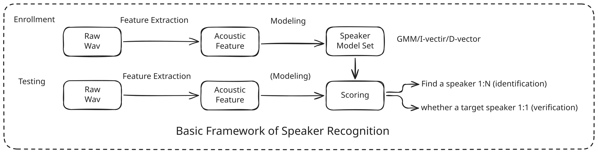

Speaker recognition is a biometric task of identifying or verifying an individual’s identity from their voice. It has undergone a profound paradigm shift over the past decades, What began as pattern matching and probabilistic generative modeling has transformed into deep metric learning due to the rapid development and application of deep neural networks.

This article attempts to provide an overview of speaker recognition technology. We outline its historical development and core technical approaches, touching upon the transition from classic subspace methods ($i$-vectors) to modern discriminative deep embeddings (such as ResNets and ECAPA-TDNN) and angular margin-based scoring.

## Task Formulation & System Framework

Speaker recognition tasks are categorized along two operational dimensions:

**Speaker Verification** (SV / 1:1 Matching):

Given an segment of speech $\mathbf{X}$ and a claimed identity $S$, evaluate the binary hypothesis:
$$\mathcal{H}_0: \text{The speech } \mathbf{X} \text{ originates from target speaker } S$$
$$\mathcal{H}_1: \text{The speech } \mathbf{X} \text{ originates from an unknown impostor } S' \neq S$$
The output is a continuous likelihood ratio or similarity score thresholded at runtime.

**Speaker Identification** (SI / 1:N Matching): 

Given an segment of speech $\mathbf{X}$ and an enrolled gallery of $N$ known speakers $\mathcal{S} = \{S_1, S_2, \dots, S_N\}$, assign $\mathbf{X}$ to speaker $S_k^*$:

$$S_k^* = \arg\max_{S_k \in \mathcal{S}} P(S_k \mid \mathbf{X})$$

Speaker identification is further classified into two types:

- Closed-Set: Assumes the true speaker is strictly present in $\mathcal{S}$.
- Open-Set: Incorporates an outlier option $S_0$ (unknown speaker) via confidence scoring thresholding.

Beyond the core task definition, speaker recognition systems are also distinguished by how they handle speech content:

**Text-Dependent**: The speaker uses a fixed passphrase for both enrollment and verification. While this simplifies acoustic modeling, it is inherently more vulnerable to replay attacks.

**Text-Independent**: The system handles unconstrained speech, which is far more challenging as it requires the model to effectively disentangle phonetic content from unique, identity-defining speaker characteristics.

The general pipeline for a speaker recognition system is conceptually divided into two main stages: Enrollment and Testing (Verification).

1. **Enrollment Stage**: During this phase, the system captures the target speaker's voice to build a unique speaker profile. The speech signal is first processed through an acoustic feature extraction module to obtain informative representations. These acoustic features are then fed into a modeling component—traditionally statistical models or modern deep neural networks—to create a reference speaker template (or enrollment embedding) that captures the distinctive characteristics of the individual's voice.

2. **Testing Stage**: During the verification or identification phase, a test speech segment is processed using the same acoustic feature extraction pipeline. Once the test features are obtained, they are compared against the enrolled speaker template(s). A pattern matching and scoring mechanism is then employed to compute the similarity between the test segment and the enrolled model, producing a final decision based on the output score.

The figure below illustrates the framework for these two stages.

## Acoustic Features: Representation in Time & Frequency

Raw audio signals, such as those sampled at 16 kHz, consist of a series of discrete numerical values representing amplitude over time. While these raw waveforms are inherently complex and high-dimensional, speech signals exhibit quasi-stationary statistical properties over short temporal windows (typically 20–30 milliseconds). This fundamental characteristic allows us to employ time-frequency analysis to extract more stable and informative features.

In the context of speaker recognition, two primary types of features are widely utilized to capture these spectral characteristics:

1. **Mel-Frequency Cepstral Coefficients (MFCCs)**: Inspired by human auditory perception, MFCCs are derived by applying a Fourier transform to windowed speech segments, followed by mapping the power spectrum onto the Mel scale, which mimics the non-linear human perception of frequency, and it finally applying a Discrete Cosine Transform (DCT) to decorrelate the spectral coefficients. These have been the industry standard for decades due to their ability to represent the vocal tract envelope effectively.

2. **Filterbank Features (Fbanks)**: Unlike MFCCs, filterbank features retain the correlation between adjacent frequency bins by omitting the DCT step. In the deep learning era, raw log-mel filterbanks have become the preferred input for neural networks. Because modern architectures (like CNNs and Transformers) are highly capable of capturing feature correlations and patterns, the additional decorrelation provided by the DCT is often unnecessary and can even discard useful information.

Consequently, many deep neural network-based modeling approaches prefer using Fbanks as the input features. Some research has even explored using raw waveforms directly as input, leveraging **neural networks to perform end-to-end feature extraction**.

The frontend transforms raw continuous audio $s(t)$ into a sequence of discrete spectral vectors $\mathbf{X} \in \mathbb{R}^{T \times D}$.

## Classical Era: Statistical Generative & Subspace Approaches

Before deep neural networks took over speech, speaker recognition relied on statistical generative models.

### Build Speaker Model using Gaussian Mixture Models (GMM)

Why use a Gaussian Mixture Model for speech modeling? Speech consists of distinct phonetic units (vowels, fricatives, plosives). A speaker's vocal tract shapes these sounds differently than another person's.

A single Gaussian distribution cannot model this acoustic feature space due to the complex phonetic units. However, a mixture of $C$ Gaussians can do that, each Gaussian component effectively models a cluster of phonetic or articulatory sound configurations.

A Gaussian Mixture Model evaluates frame likelihood as:

$$p(\mathbf{x}\_t \mid \boldsymbol{\lambda}) = \sum\_{c=1}^{C} w\_c \mathcal{N}(\mathbf{x}\_t \mid \boldsymbol{\mu}\_c, \boldsymbol{\Sigma}\_c)$$

In this formulation, $\mathbf{x}\_t$ represents the acoustic feature vector at time frame $t$. The model parameters $w\_c$, $\boldsymbol{\mu}\_c$, $\boldsymbol{\Sigma}\_{c}$ are the mixture weights, mean vectors, and covariance matrices for each Gaussian component, respectively. These parameters are typically trained to characterize the distribution of a speaker's unique acoustic space, effectively mapping the variability of phonemes and vocal tract characteristics into a probabilistic framework.

However, to train a stable $C$-component GMM using Maximum Likelihood Estimation (via the EM algorithm), a system needs several minutes of audio per speaker. In real application, enrollment speech is limited to a few seconds. Estimating thousands of parameters ($\boldsymbol{\mu}_c, \boldsymbol{\Sigma}_c$) directly from short audio clips leads to serious performance bottleneck.

### The Universal Background Model (GMM-UBM)

To address data scarcity during enrollment, [Reynolds et al](https://www.sciencedirect.com/science/article/abs/pii/S1051200499903615). introduced the Universal Background Model (UBM). Instead of training a target speaker's model from scratch, we first train a large GMM on hundreds of hours of multi-speaker audio. This UBM acts as a prior distribution representing general human speech dynamics.

When enrolling a new speaker with limited audio, we do not re-estimate all parameters. Instead, we use Maximum A Posteriori (MAP) adaptation. We map the target speaker's frames to the UBM components, calculating posterior alignment probabilities $\gamma_c(t)$. The target speaker's Gaussian means are then shifted relative to the background model:

$$\tilde{\boldsymbol{\mu}}_c = \alpha_c \mathbf{E}_c(\mathbf{X}) + (1 - \alpha_c) \boldsymbol{\mu}_c^{UBM}$$

Where $\mathbf{E}_c(\mathbf{X})$ is the mean of the aligned frames, and $\alpha_c$ is a data-dependent adaptation weight. If a speaker provides minimal data for a specific sound cluster, $\alpha_c \to 0$, causing the model to safely retain the UBM background parameter.

The following diagram illustrates the MAP (Maximum A Posteriori) adaptation process within the GMM-UBM framework. For simplicity, this example represents a two-component GMM in a two-dimensional feature space. The black ellipses represent the initial distribution of the Universal Background Model (UBM). When new enrollment data from a target speaker becomes available (depicted as red scatter points), the MAP adaptation process shifts the parameters of the UBM components toward the observed data, resulting in the adapted speaker-specific model (shown in blue).

In scoring stage, compares the likelihood of a test segment $\mathbf{X}$ under the adapted Target GMM versus the UBM:

$$\text{LLR}(\mathbf{X}) = \frac{1}{T}\sum_{t=1}^T \left[ \log p(\mathbf{x}\_t \mid \boldsymbol{\lambda}\_{Target}) - \log p(\mathbf{x}_t \mid \boldsymbol{\lambda}\_{UBM}) \right]$$

This Log-Likelihood Ratio (LLR) normalizes the score: background acoustic variations cancel out, leaving a score focused on speaker differences.

The GMM-UBM framework was a landmark in the evolution of speaker recognition, effectively bridging the gap between theoretical research and practical, real-world deployment. Its design offered a robust solution to the data scarcity problem that had plagued earlier attempts at speaker modeling. By leveraging a common prior, the Universal Background Model, the system could interpret limited enrollment data within the context of a well-defined global speaker space. This architectural elegance not only provided a standard, scalable method for enrollment but also offered a stable probabilistic scoring mechanism through the Log-Likelihood Ratio, which significantly enhanced system discriminability and reliability in operational environments.

### Joint Factor Analysis (JFA)

If we concatenate all component mean vectors $\hat{\boldsymbol{\mu}}_c \in \mathbb{R}^D$ from an adapted GMM-UBM, we form a high-dimensional vector $\mathbf{M} \in \mathbb{R}^{CD}$ called a GMM **Supervector** (for example: $512 \text{ components} \times 60 \text{ dimensions} = 30,720 \text{ dimensions}$).

While the GMM Supervector captures speaker identity, it also captures channel noise, microphone frequency responses, and room reverberation. If Speaker A records enrollment audio over a landline telephone and verification audio over a smartphone microphone, the distance between the two recordings in the supervector space will reflect the channel change rather than the speaker's true identity.

Joint Factor Analysis (JFA) addresses this by decomposing the high-dimensional supervector $\mathbf{M}$ into independent additive factors:

$$\mathbf{M} = \mathbf{m} + \mathbf{V}\mathbf{y} + \mathbf{U}\mathbf{x} + \mathbf{D}\mathbf{z}$$

$\mathbf{m} \in \mathbb{R}^{CD}$: The speaker-independent UBM base supervector.

$\mathbf{V} \in \mathbb{R}^{CD \times R_v}$: The low-rank Eigenvoice matrix, spanning the primary axes of human speaker variation.

$\mathbf{y} \sim \mathcal{N}(\mathbf{0}, \mathbf{I})$: Low-dimensional latent speaker factors.

$\mathbf{U} \in \mathbb{R}^{CD \times R_u}$: The low-rank Eigenchannel matrix, spanning common acoustic channel distortions.

$\mathbf{x} \sim \mathcal{N}(\mathbf{0}, \mathbf{I})$: Low-dimensional latent channel factors.

$\mathbf{D} \in \mathbb{R}^{CD \times CD}$: A diagonal residual matrix.

$\mathbf{z} \sim \mathcal{N}(\mathbf{0}, \mathbf{I})$: Latent residual factors.

The residual term $\mathbf{D}\mathbf{z}$ is also essential because the low-rank approximations $\mathbf{V}\mathbf{y}$ and $\mathbf{U}\mathbf{x}$ often fail to capture all the variability present in the data. $\mathbf{D}$ acts as a "catch-all" component, modeling the remaining idiosyncratic variations or noise components that cannot be easily decomposed into pure speaker or channel subspaces. By accounting for this residual, JFA provides a more comprehensive, albeit computationally expensive, probabilistic model of the supervector's composition.

JFA worked well in theory, but suffered from a core assumption: it assumed that speaker variability ($\mathbf{V}\mathbf{y}$) and channel variability ($\mathbf{U}\mathbf{x}$) were strictly orthogonal.In practice, acoustic channels interact non-linearly with speaker characteristics. Channel noise distorts vocal tract spectral peaks, causing channel factors to bleed into the speaker space.

### I-vector (Total Variability Space)

This complex separation of speaker and channel subspaces often proved impractical, as the boundary between identity and environment is rarely cleanly defined. Recognizing that these sources of variation are inextricably entangled, it shifted toward a more unified representation.

In 2010, [Dehak et al](https://dl.acm.org/doi/abs/10.1109/TASL.2010.2064307). proposed a counter-intuitive paradigm shift: stop trying to force artificial mathematical separation between speaker and channel variability during feature extraction.Instead of maintaining separate matrices $\mathbf{V}$ and $\mathbf{U}$, Dehak combined all variability into a single low-rank Total Variability Space:

$$\mathbf{M} = \mathbf{m} + \mathbf{T}\mathbf{w}$$

Where:

$\mathbf{T} \in \mathbb{R}^{CD \times d}$ is a low-rank matrix ($d \ll CD$, typically $d \in [400, 600]$) capturing the primary directions of all acoustic variance.

$\mathbf{w} \sim \mathcal{N}(\mathbf{0}, \mathbf{I})$ is a low-dimensional latent vector termed the Total Variability Vector, or $i$-vector.

The $i$-vector framework decoupled feature extraction from channel compensation, dividing the speaker feature extraction process into two distinct, sequential steps:

1. Extraction: The $i$-vector $\mathbf{w}$ maps variable-length speech into a single fixed-length vector that captures everything (identity + channel + environment).

2. Compensation: Because $\mathbf{w}$ is a standard vector in $\mathbb{R}^d$, downstream linear modeling techniques (such as **LDA** or **PLDA**) can remove channel dimensions using large-scale supervised datasets.

## Deep Learning Era: Discriminative Embeddings

When deep neural networks (DNNs) entered the field, they introduced a discriminative paradigm: instead of modeling acoustic distributions, train a deep network end-to-end to classify speaker identities over large datasets, then extract intermediate activations as speaker representations.

### D-vector (Deep Speaker Vector)

The earliest deep learning attempt the [$d$-vector (Variani et al., 2014)](https://ieeexplore.ieee.org/document/6854363) used a Feed-Forward DNN trained on frame-level speaker classification. Once the DNN has been trained successfully, the speakerdiscriminative features could be read from any hidden layer. The
closer to the output layer, the more speaker-discriminative those
features will be. During inference, frame features were passed through the network, and activations were extracted from a narrow bottleneck layer.

There is a necessary underlying hypothesis that the trained
DNN, having learned compact nonlinear representations of the
speakers in the training set, this may also be able to represent
unseen speakers during inference.

Following figure describes the DNN model for learning speaker discriminative features.

$$d\text{-vector} = \frac{1}{T} \sum_{t=1}^T \mathbf{h}_t^{last-hidden -layer}$$

Once the speaker feature vectors (embeddings) are extracted, the system can compute the distance between two vectors to score their similarity. Cosine similarity is the most common metric, defined as the cosine of the angle between two embedding vectors $\mathbf{v}_1$ and $\mathbf{v}_2$.

While simpler than $i$-vector pipelines, $d$-vectors suffered from a structural flaw: frame independence. The network processed each frame $\mathbf{x}_t$ in isolation, ignoring temporal dynamics across phone transitions.

### X-vector (TDNN & Statistical Pooling)

[Snyder et al. (2018)](https://www.danielpovey.com/files/2018_icassp_xvectors.pdf) addressed this frame independence limitation with the $x$-vector framework, establishing another network architectural template for deep speaker recognition.

Instead of processing frames individually, [TDNNs](https://www.danielpovey.com/files/2015_interspeech_multisplice.pdf) use 1D dilated convolutions to aggregate context over time. A layer $l$ at time step $t$ constructs its representation from contextual frames at layer $l-1$:

$$\mathbf{h}\_t^{(l)} = f \left( \mathbf{W}^{(l)} \cdot \text{concat} \left( \mathbf{h}\_{t-\tau}^{(l-1)}, \dots, \mathbf{h}\_t^{(l-1)}, \dots, \mathbf{h}\_{t+\tau}^{(l-1)} \right) + \mathbf{b}^{(l)} \right)$$

Stacking TDNN layers expands the temporal receptive field from local frame windows (e.g., $\pm 2$ frames) to broad sentence-level contexts (e.g., $\pm 15$ frames).

The figure below illustrates the TDNN network architecture. As shown, the model progressively aggregates frame-level features into robust, speaker-discriminative sentence-level representations through successive layers of temporal stacking. By increasing the receptive field at each layer, the network captures longer-range phonetic dependencies and speaking dynamics, effectively transforming local acoustic observations into a global summary of speaker identity.

To map variable frame sequences $\mathbf{H} = \{\mathbf{h}_1, \dots, \mathbf{h}_T\} \in \mathbb{R}^{T \times D'}$ into a fixed-size vector, the $x$-vector network uses a Statistical Pooling Layer. It computes the mean vector $\boldsymbol{\mu}$ and sample standard deviation vector $\boldsymbol{\sigma}$ across time $T$:

$$\boldsymbol{\mu} = \frac{1}{T} \sum_{t=1}^T \mathbf{h}\_t, \quad \boldsymbol{\sigma} = \sqrt{\frac{1}{T} \sum\_{t=1}^T (\mathbf{h}\_t - \boldsymbol{\mu}) \odot (\mathbf{h}\_t - \boldsymbol{\mu})}$$

$$\mathbf{v}_{pool} = \left[ \boldsymbol{\mu} \,;\, \boldsymbol{\sigma} \right] \in \mathbb{R}^{2D'}$$

The $x$-vector architecture typically follows the statistical pooling layer with several fully connected layers. Unlike the $d$-vector, which extracts features from a frame-level bottleneck, the $x$-vector extracts the speaker embedding from the penultimate fully connected layer that operates on the aggregated mean and standard deviation statistics. By processing these global representations through subsequent non-linear transformations, the network effectively maps the temporal variations captured in the statistical pooling layer into a highly discriminative, compact latent space specialized for speaker identity.

Considering why include standard deviation? The mean vector $\boldsymbol{\mu}$ captures static acoustic averages, while the standard deviation $\boldsymbol{\sigma}$ captures temporal variations in a speaker's cadence and vocal dynamics over time.

### ECAPA-TDNN

While effective, standard $x$-vectors process feature channels uniformly and weight all frame time steps equally during statistical pooling. [ECAPA-TDNN (Desplanques et al., 2020)](https://arxiv.org/abs/2005.07143) introduced some structural improvements.

Uniform statistical pooling treats all frames equally. However, silence, background noise, and unvoiced consonants contain little identity information compared to long, voiced vowels.**Attentive Statistics Pooling (ASP)** addresses this by learning a continuous attention scalar $\alpha_t$ for each frame:

$$\alpha_t = \frac{\exp(\mathbf{v}^T \text{tanh}(\mathbf{W} \mathbf{h}\_t + \mathbf{b}))}{\sum_{\tau=1}^T \exp(\mathbf{v}^T \text{tanh}(\mathbf{W} \mathbf{h}\_\tau + \mathbf{b}))}$$

$$\boldsymbol{\mu}\_{asp} = \sum_{t=1}^T \alpha\_t \mathbf{h}\_t, \quad \boldsymbol{\sigma}\_{asp} = \sqrt{\sum\_{t=1}^T \alpha\_t (\mathbf{h}\_t - \boldsymbol{\mu}\_{asp})^2}$$

By discounting uninformative or corrupted frames, ASP produces speaker representations that are significantly more resilient to short-duration artifacts and localized acoustic interference.

Beyond Attentive Statistics Pooling, ECAPA-TDNN further refines the architecture using 1D-Res2Net blocks and Squeeze-and-Excitation (SE) modules. The Res2Net blocks replace standard convolutions to capture multi-scale temporal context by splitting feature channels into hierarchical sub-groups, while the SE modules dynamically recalibrate channel importance by calculating global statistics across time to weigh informative features.

## Scoring & Normalization

Extracting a fixed-length representation, whether an $i$-vector or deep embedding is only the first step. A complete system requires a backend to compute similarity scores between enrollment and test vectors.

### Discriminative Linear Transformation (LDA & WCCN)

Before passing vectors to a scoring function, linear transformations help minimize channel variance. Specifically, we often employ linear transformations to decorrelate dimensions and enhance the discriminative power of the embeddings. Two widely used methods for this purpose are:

- Linear Discriminant Analysis (LDA): Finds projection axes $\mathbf{W}$ that maximize inter-speaker distance $\mathbf{S}_B$ while minimizing intra-speaker distance $\mathbf{S}_W$:

$$\mathbf{J}(\mathbf{W}) = \frac{\mathbf{W}^T \mathbf{S}_B \mathbf{W}}{\mathbf{W}^T \mathbf{S}_W \mathbf{W}}$$

- Within-Class Covariance Normalization (WCCN): Scales dimensions by the inverse intra-speaker covariance matrix, preventing noisy feature dimensions from skewing distance measurements.

### Probabilistic Linear Discriminant Analysis (PLDA)

For $i$-vectors and early deep embeddings, PLDA served as the standard scoring backend. Here, we provide a brief introduction to PLDA.

PLDA models an extracted embedding $\mathbf{e}_{i,j}$ (speaker $i$, recording $j$) as a combination of latent variables:

$$\mathbf{e}\_{i,j} = \boldsymbol{\mu} + \mathbf{F}\mathbf{h}\_i + \boldsymbol{\epsilon}\_{i,j}$$

$\boldsymbol{\mu}$: Global mean embedding across all training speakers.

$\mathbf{F}\mathbf{h}_i$: Latent speaker identity component ($\mathbf{h}_i \sim \mathcal{N}(\mathbf{0}, \mathbf{I})$).

$\boldsymbol{\epsilon}\_{i,j}$: Latent channel noise component ($\boldsymbol{\epsilon}\_{i,j} \sim \mathcal{N}(\mathbf{0}, \boldsymbol{\Sigma})$).

In Scoring stage, instead of the simple cosine scoring method, verification compares two hypotheses for embeddings $\mathbf{e}_1$ and $\mathbf{e}_2$:

$\mathcal{H}_0$: Both embeddings share the same speaker identity ($\mathbf{h}_1 = \mathbf{h}_2$).

$\mathcal{H}_1$: The embeddings originate from different speakers ($\mathbf{h}_1 \neq \mathbf{h}_2$).

Evaluating the Log-Likelihood Ratio $P(\mathbf{e}_1, \mathbf{e}_2 \mid \mathcal{H}_0) \,/\, P(\mathbf{e}_1, \mathbf{e}_2 \mid \mathcal{H}_1)$ yields a fast, symmetric quadratic scoring function:

$$\text{Score}(\mathbf{e}_1, \mathbf{e}_2) = \mathbf{e}_1^T \mathbf{Q} \mathbf{e}_1 + \mathbf{e}_2^T \mathbf{Q} \mathbf{e}_2 + 2\mathbf{e}_1^T \mathbf{P} \mathbf{e}_2$$

Where $\mathbf{Q}$ and $\mathbf{P}$ are pre-computed matrices derived during PLDA training.

### Score Normalization

Raw similarity scores can drift depending on recording length, acoustic noise, or where an embedding sits on the hypersphere. A pair of low-quality recordings might produce a raw cosine score for example of 0.35 that represents a match, while a pair of pristine recordings might produce a score of 0.45 that represents an impostor. To maintain a consistent global threshold, systems use Adaptive Symmetric Normalization (AS-Norm).

The key intuition behind score normalization is to use a set of cohort speaker utterances to standardize the scores, thereby addressing the issue of threshold variability. Given an enrollment embedding $\mathbf{e}_e$, test embedding $\mathbf{e}\_t$, and an un-enrolled cohort dataset $\mathcal{C}$, AS-Norm normalizes scores using statistics calculated from the top $N$ most similar cohort samples ($\mathcal{C}\_{top}$):

$$S_{norm}(\mathbf{e}\_e, \mathbf{e}\_t) = \frac{1}{2} \left( \frac{S(\mathbf{e}\_e, \mathbf{e}\_t) - \mu(\mathbf{e}\_e, \mathcal{C}\_{top})}{\sigma(\mathbf{e}\_e, \mathcal{C}\_{top})} + \frac{S(\mathbf{e}\_e, \mathbf{e}\_t) - \mu(\mathbf{e}\_t, \mathcal{C}\_{top})}{\sigma(\mathbf{e}\_t, \mathcal{C}\_{top})} \right)$$

This step scales raw similarity scores into calibrated likelihood units, stabilizing false acceptance and false rejection rates across varying acoustic environments.

## Robustness and Engineering Approach

In production speaker verification systems, acoustic domain shift, caused by background noise, room reverberation, microphone hardware mismatch, and short speech duration is the primary cause of system failure.

Instead of relying on theoretical domain adaptation proofs, modern industrial pipelines address these issues through on-the-fly data augmentation, VAD-driven front-end filtering, targeted fine-tuning

### Short-Utterance Handling and Front-End Preprocessing
Audio recordings under 2 seconds often cause embedding drift due to unvoiced noise frames and insufficient phonetic coverage. Production systems resolve this using strict front-end preprocessing and dynamic duration training.

- Front-End VAD: Run lightweight VAD (e.g., Silero VAD or WebRTC VAD) before feature extraction. Set threshold to $0.5–0.6$ speech probability to strip leading/trailing silence and non-speech pauses.

- Energy-Based Frame Filtering: Drop frame log-energy values falling below $25\text{ dB}$ relative to the peak frame energy to ensure the pooling layer only aggregates speech-active regions.

- Short-Audio Inference Rule:
  - Duration $< 0.8\text{s}$: Reject immediately or request re-enrollment/re-prompt.
  - $0.8\text{s} \le \text{Duration} \le 1.5\text{s}$: Apply Repeat-Tiling (duplicate the speech segment back-to-back to reach at least $2.0\text{s}$) before feeding into the network to prevent temporal pooling variance.

### Production Data Augmentation Pipeline

Training a deployable speaker model requires augmenting clean speech on-the-fly during mini-batch generation. Offline pre-augmented datasets are inefficient on storage and limit noise combination variety.

The following is a recommand augmentation recipe:

|Augmentation Type | Dataset / Source | Production Parameter Range |
| :--- | :--- | :--- |
|Additive Noise | MUSAN (Noise, Music, Speech) | SNR: $5\text{ dB}$ to $20\text{ dB}$
|Reverberation | Simulated RIRs + Real RIRs (Simulated Room Impulse) | Room Sizes: $3\times3\times2.5\text{m}$ to $10\times8\times4\text{m}$; RT60: $0.2\text{s}–0.8\text{s}$ |
|SpecAugment | On-the-Fly Spectrogram Masking |Freq Masks: $F=15$ channels; Time Masks: $T=25$ frames |

### Domain Adaptation & Channel Invariance Techniques

When deploying a model trained on open datasets (e.g., VoxCeleb, 16kHz clean/far-field speech) to a target domain (e.g., 8kHz telephone customer service calls or noisy smart-speaker hardware), feature distribution shift degrades accuracy. Use the following engineering step to adapt the system.

- Rather than training from scratch using a target-domain fine-tuning method. 

  - Freeze Lower Layers: Freeze the first 2–3 convolutional stages (or TDNN blocks) of the feature extractor. Fine-tune only the temporal pooling layer and output projection bottlenecks.
  
  - Learning Rate Warmup: Set the initial fine-tuning learning rate to $1/10\text{th}$ of the pre-training LR (e.g., $10^{-4} \to 10^{-5}$) using a Cosine Annealing scheduler.
  
  - Balanced Sampling: Mix target domain data with source domain data in a 7:3 ratio per mini-batch to prevent catastrophic forgetting of base acoustic characteristics.

- Production score normalization using target domain cohort.

## Challenges & Future

Despite significant advances in modern speaker recognition, several emerging challenges require ongoing research across security, architecture, and edge deployment.

### Anti-Spoofing & Voice Deepfake Detection

The rapid evolution of generative speech synthesis—including zero-shot Text-to-Speech (TTS) and Voice Conversion (VC) models poses a direct threat to biometric security. Modern vocoders can clone a target speaker's voice using only a few seconds of stolen reference audio. Because deep speaker verification models are explicitly trained to focus on speaker identity traits, they can be easily fooled by synthetic audio that accurately replicates those identity traits.

### Universal Speech Foundation Models

Historically, speaker recognition models were trained from scratch on task-specific classification datasets. Today, the field is transitioning toward using large-scale Self-Supervised Learning (SSL) foundation models. 

Models like Wav2Vec, pre-trained on massive quantities of unlabeled audio, capture rich, hierarchical linguistic and acoustic information. By leveraging these powerful representations, we can develop speaker recognition systems that achieve state-of-the-art performance using only a fraction of the labeled data previously required. The future of the field lies in effective fine-tuning and adaptation techniques that enable rapid speaker enrollment, allowing systems to generalize robustly across diverse, low-resource scenarios.

### Ultra-Low Latency & Streaming Speaker Verification

Real-world edge applications such as continuous voice authentication on smart wearables, automotive control units, and industrial IoT devices cannot process audio in offline batches. They require streaming verification which evaluating speaker identity continuously as audio streams in, with processing latencies under 200 milliseconds.

This necessitates the development of efficient model compression techniques—such as quantization and pruning, and lightweight neural architectures designed specifically for hardware constrained inference environments.
